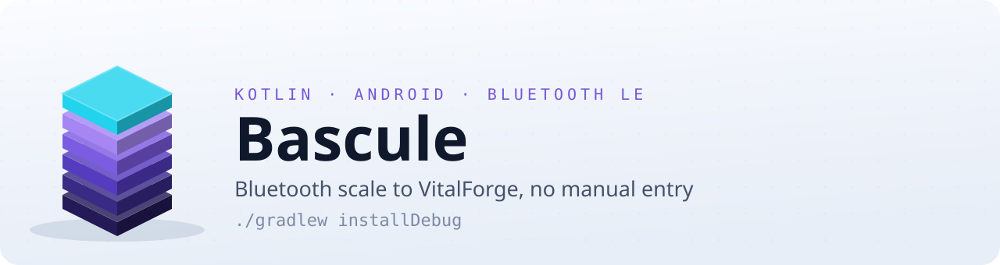

<!-- glowup:hero start -->
<div align="center">
<h1>
  <picture>
    <source media="(prefers-color-scheme: dark)" srcset="docs/assets/banner.svg">
    
  </picture>
</h1>

[](https://github.com/bearyjd/bascule/actions/workflows/ci.yml)
[](LICENSE)


</div>
<!-- glowup:hero end -->

Bascule is an Android app that stands between a Bluetooth bathroom scale and a
self-hosted [VitalForge](https://github.com/bearyjd/vitalforge) instance. You step on
the scale; the reading lands in VitalForge. There is no tap-to-sync, no manual entry,
and no vendor cloud in the middle.

The name is French for *scale* — the weighing kind.

> [!WARNING]
> **Pre-v1 and not yet hardware-validated on current `main`.** The decode path was
> confirmed against a physical BF720 during an earlier capture session, but none of the
> recent fix rounds have been re-run against real hardware. Treat this as a working
> prototype, not a finished app. See [Status](#status).

## Why this exists

VitalForge's intended weight workflow is an NFC tap plus typing the number in by hand.
That works, and it is also the step people skip. Bascule removes it: the scale already
knows the weight, and it already speaks Bluetooth, so the number should travel on its
own.

It is the mobile-side counterpart to the Atlas-hosted `ble-scale-sync` listener — same
outcome, different bridge.

## What it does

- **Listens for the scale** in the background, including across reboots, and wakes only
  when one actually reports a measurement.
- **Decodes the full reading**, not just weight — the BF720 reports bioimpedance-derived
  body composition alongside it, and Bascule keeps all of it.
- **Persists locally first.** Readings go into a Room database before any network call,
  so a weigh-in is never lost to a flaky connection or an unreachable server.
- **Delivers to VitalForge** over HTTPS to `POST /api/weight`, retrying transient
  failures and holding the queue when the server is down.
- **Shows its work** — a history screen with the stored readings and diagnostics
  counters, plus manual entry for the times the scale wins.

### Supported hardware

**Beurer BF720** only, for v1. It was chosen after reviewing openScale's supported-scale
matrix; it speaks the standard Bluetooth SIG Weight Scale / Body Composition / User Data
profile rather than a proprietary opcode protocol, which is what makes the integration
tractable and portable.

That standards-based decode path is the reason other SIG-compliant scales are plausible
future targets — but none are supported or tested today.

## How it works

The interesting part is that the BF720 will not send you anything until you have
introduced yourself.

The scale gates its Weight and Body Composition indications behind the Bluetooth SIG
**User Data Service User Control Point** (`0x2A9F`). A client has to register as a user
and present a consent code before the scale will talk. Bascule does that handshake, then
holds a short GATT session while the measurement frames arrive:

```
scan (background, filtered)
  └─> GATT session
        ├─ register user / consent  (0x2A9F)
        ├─ subscribe to Weight + Body Composition
        └─ correlate the two frame types into one reading
              └─> Room (local, durable)
                    └─> delivery queue ──> POST /api/weight
```

Weight and body-composition data arrive as **separate frames** that must be paired into a
single logical reading — the correlator handles that, along with the cases where one
half never shows up.

Each scale profile occupies one of the device's **8 user slots**, so registration is
deliberately not something the app does casually.

Every protocol constant in the source — each UUID, opcode, byte offset, and scale factor
— carries a provenance comment naming the document or handler it came from. A constant
without one is treated as a review blocker, because a guessed scale factor produces
plausible-looking wrong weights that no test catches.

## Requirements

| | |
|---|---|
| Android | 8.0 Oreo (API 26) or newer |
| Hardware | Beurer BF720; a phone with Bluetooth LE |
| Server | A reachable VitalForge instance you can log into |
| Build | JDK 17, Android SDK (compile/target 37) |

## Build and install

```bash
git clone https://github.com/bearyjd/bascule.git
cd bascule
./gradlew installDebug
```

Run the checks CI runs:

```bash
./gradlew test detekt
```

## Setup

1. **Grant permissions.** Bascule needs Bluetooth scan/connect and — on Android's
   background-scan model — location, including background location. It asks for these in
   context rather than all at once on first launch.
2. **Point it at VitalForge.** Enter your instance URL and sign in. Credentials are
   exchanged for a session cookie; the cookie is stored encrypted, and the password is
   not retained.
3. **Register the scale.** Bascule picks a user slot and a consent code, then performs
   the `0x2A9F` handshake. Registration burns one of the scale's 8 slots, so re-register
   only when you mean to.
4. **Step on the scale.** Subsequent weigh-ins are hands-off.

Settings can be exported and re-imported, so a reinstall does not mean redoing the
handshake dance from scratch. Because that export necessarily carries your VitalForge
credential and the scale's consent codes, it is written as a passphrase-encrypted blob
(PBKDF2-HmacSHA256, AES-GCM) rather than plain JSON — no secret is emitted as
plaintext, and the backup is only as strong as the passphrase you choose for it.

## Privacy

Body-composition data is about as personal as data gets, so the shape of this matters:

- Readings go **only** to the VitalForge instance you configure. There is no vendor
  cloud, no telemetry, and no analytics.
- Delivery is **HTTPS-only**, enforced in two places rather than one: a non-`https://`
  base URL is rejected when you enter it, and the app's network security config forbids
  cleartext traffic to every destination, so a future `targetSdk` bump cannot quietly
  relax it.
- The VitalForge session cookie and the scale consent codes are held in encrypted
  storage.
- Everything else stays on the device, in a local database you control.

## Tech

Kotlin throughout, Jetpack Compose for UI, Room for persistence, WorkManager for the
delivery queue and BLE session scheduling, and a foreground service for the always-on
bridging path. Dependencies are AndroidX and kotlinx only, with OkHttp as the single
deliberate exception for HTTP.

Tests are JVM-only (Robolectric where Android framework classes are unavoidable); there
is no instrumented test lane at present, which is a known gap rather than an oversight.

## Status

Pre-v1. The build is green and the test suite passes, but the app has not been validated
end-to-end against physical hardware since the most recent round of fixes.

Known open work is tracked in `HANDOFF.md` and `docs/prp/01-plan.md`. The larger items:
replay/idempotency semantics on the VitalForge side, a successor to the now-deprecated
`EncryptedSharedPreferences`, and the recovery path for a scale whose 8 user slots are
all taken.

## Documentation

The design record lives in [`docs/prp/`](docs/prp/) and is worth reading in this order
before touching decoder or handshake code:

| document | what it holds |
|---|---|
| [`00-design.md`](docs/prp/00-design.md) | Original design. Several sections are superseded — see below. |
| [`decisions.md`](docs/prp/decisions.md) | The ADRs. **ADR-007** is the important one: the BF720 speaks standard SIG profiles, not a proprietary protocol. |
| [`02-interface-revision.md`](docs/prp/02-interface-revision.md) | The current decoder/transport/session interfaces. **Supersedes `00-design.md`.** |
| [`02-phase2-dispositions.md`](docs/prp/02-phase2-dispositions.md) | A Phase 2 adversarial review pass. |
| [`01-plan.md`](docs/prp/01-plan.md) | The work packages, as amended. |
| [`03-hardware-validation.md`](docs/prp/03-hardware-validation.md) | Raw captured bytes from the physical scale, and their decode. |

## Acknowledgements

The protocol understanding behind the BF720 integration comes from reading
[**openScale**](https://github.com/oliexdev/openScale)'s `StandardWeightProfileHandler`
and `StandardBeurerSanitasHandler` — specifically, that the User Control Point handshake
is what gates measurement indications. That was the missing piece after a stretch of
watching a connected, subscribed phone receive nothing while the scale happily displayed
readings on its own screen.

openScale is GPL-3.0. **No openScale source is used here.** The decoders were
reimplemented from protocol understanding, per ADR-002 — protocol facts like a UUID or a
byte offset are not copyrightable expression. The acknowledgement stands regardless of
the licence question being moot.

## License

Copyright (C) 2026 Ventouxlabs

Licensed under the **GNU Affero General Public License v3.0** — see [LICENSE](LICENSE)
for the full text.

This program is free software: you can redistribute it and/or modify it under the terms
of the GNU Affero General Public License as published by the Free Software Foundation,
either version 3 of the License, or (at your option) any later version. It is
distributed in the hope that it will be useful, but WITHOUT ANY WARRANTY; without even
the implied warranty of MERCHANTABILITY or FITNESS FOR A PARTICULAR PURPOSE. See the GNU
Affero General Public License for more details.

VitalForge is a separate project under the MIT license; contributions made back to it
are MIT.
