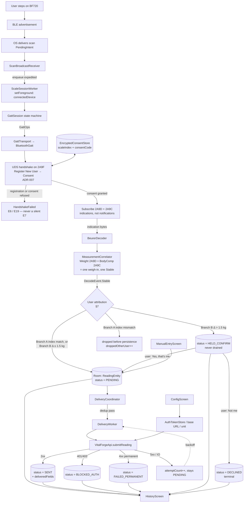
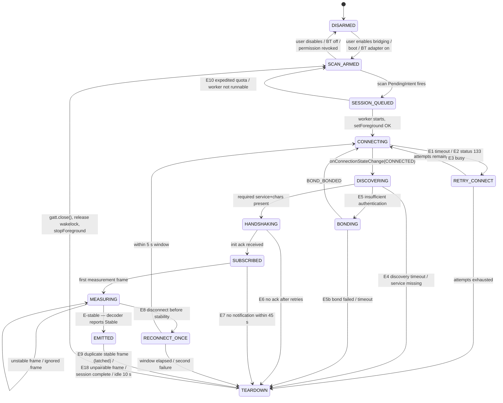
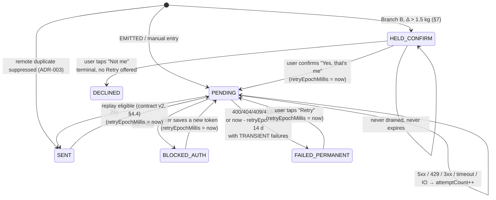

# Bascule — Phase 0 Design

Status: **complete; amended in Phase 2 against the devil's advocate findings**
Inputs: `docs/prp/bascule-prp.md` (requirements), `docs/prp/bascule-agent-prompt.md` (process)
Companion: `docs/prp/decisions.md` (ADR-001 … ADR-007)

Sections amended in Phase 2, each marked in place: §1.2 (data-flow diagram),
§2.1 (persist rule, retired second-user edge), §2.3 (E6, E7, E9, and new E17–E19),
§2.4, §2.5, §2.7 and §3.1 (provisional banners), §3.3, §4.4, §7, §8.1, §8.4,
§8.8, §9 (provisional banner). The per-objection record of what was changed and
why is `docs/prp/02-phase2-dispositions.md`.

This document is the structural design only. It deliberately contains **no BLE
protocol constants** (UUIDs, opcodes, scale factors) — those are sourced with
provenance comments in Phase 3, per the agent prompt's ground rules. See
[§9 Constants deferred to Phase 3](#9-constants-deferred-to-phase-3).

---

## 0. Source-of-truth reconciliation

The PRP contradicts itself on the core BLE flow. §3 (Architecture / Data flow)
describes a broadcast-advertisement decode path — `ScaleScanner` matches an
advertisement, `RenphoDecoder.decode(advertisement): ScaleReading?` returns a
reading directly. §4 (BLE decode reference) states in bold that the BF720 is
**not** a pure broadcast scale and requires connect → discover → handshake →
notification subscribe → stabilization detection.

**§4 wins.** §3's data flow is stale copy from an earlier draft that targeted the
Renpho ES-CS20M (it still names `RenphoDecoder` in the step that should name the
Beurer decoder). §4 is the deliberate hardware analysis for the chosen device.
The whole of this design is built on the connection-oriented flow. Recorded as
**ADR-001**.

Two smaller reconciliations, also in `decisions.md`:

| Conflict | Resolution |
|---|---|
| PRP §3 `PendingReadingEntity` vs. §5 `ReadingEntity` | `ReadingEntity` — §5 carries the detailed schema (ADR-001, naming note) |
| PRP §5 three-status enum + "cap after N attempts (e.g. 10)" | Six statuses, adding `BLOCKED_AUTH`, `HELD_CONFIRM` and `DECLINED`; expiry is **time-based** and anchored to `retryEpochMillis`, not attempt-based and not capture-anchored (ADR-005, ADR-006) |

---

## 1. Module graph and data flow

### 1.1 Package layout

Base package `com.ventouxlabs.bascule`. Deviations from PRP §3 are marked ▲.

```
app/src/main/kotlin/com/ventouxlabs/bascule/
├── ble/
│   ├── ScaleScanner.kt            # arm/disarm PendingIntent scan; SDK-branched permissions
│   ├── ScanBroadcastReceiver.kt   # ▲ receives scan PendingIntent → enqueues session worker
│   ├── session/
│   │   ├── ScaleSessionWorker.kt  # ▲ expedited+foreground worker; owns one GATT session
│   │   ├── GattSession.kt         # ▲ the BLE state machine (§2); pure control, no decode
│   │   ├── GattTransport.kt       # ▲ interface over BluetoothGatt — faked in tests
│   │   └── SessionOutcome.kt      # ▲ terminal result + diagnostics event
│   ├── decoders/
│   │   ├── ScaleDecoder.kt        # ▲ connection-oriented interface (§2.6), NOT decode(adv)
│   │   ├── BeurerDecoder.kt       # Beurer/Sanitas family (BF720 target)
│   │   └── (RenphoDecoder.kt)     # v2 slot — not implemented in v1
│   └── ScaleReading.kt            # immutable value type, canonical units
├── service/
│   ├── BridgeForegroundService.kt # "always-on" opt-in mode only (§2.2)
│   └── BootReceiver.kt            # ▲ re-arms scan after reboot
├── data/
│   ├── ReadingEntity.kt           # full BIA payload + delivery state (§3.1)
│   ├── ReadingDao.kt
│   ├── BasculeDatabase.kt
│   └── Converters.kt              # ▲ Set<ReadingField> ↔ TEXT
├── delivery/
│   ├── DeliveryCoordinator.kt     # ▲ dedup + status transitions; no HTTP
│   ├── DeliveryWorker.kt          # ▲ WorkManager drain (one-shot expedited + periodic)
│   └── DedupPolicy.kt             # ▲ §3.3 rules, unit-tested standalone
├── network/
│   ├── VitalForgeApi.kt           # ▲ single versioned interface (§4)
│   ├── ReadingPayloadShaper.kt    # ▲ V1 / V2 body shaping
│   ├── VitalForgeHttpClient.kt    # OkHttp impl; response hardening (§8.7)
│   └── AuthTokenStore.kt          # EncryptedSharedPreferences wrapper
├── ui/
│   ├── ManualEntryScreen.kt
│   ├── ConfigScreen.kt
│   └── HistoryScreen.kt
└── MainActivity.kt
```

▲ additions exist because the connection-oriented flow needs a session owner and
a fakeable transport; the broadcast design in PRP §3 needed neither.

### 1.2 Data flow



**The receiver never holds the GATT connection.** A `BroadcastReceiver` is dead
after ~10 s (`goAsync()` window); a BF720 session runs tens of seconds. The
receiver's only job is to enqueue the worker. This is the direct architectural
consequence of ADR-001 and is called out because getting it wrong produces a
design that appears to work in the foreground and never works from a cold app.

---

## 2. BLE state machine

### 2.1 States



> **Retired edge — `EMITTED --> MEASURING: second distinct userIndex (max 2)`.**
> Removed under O-03: a Body Composition frame identifies neither its user nor
> its weigh-in, so a second weigh-in inside one session makes every subsequent
> body-comp frame unpairable rather than merely unattributed. The correlator
> latches at **one emission per session** and drops what follows (E18). E9's
> "at most 2 distinct userIndexes" is unreachable for this decoder and is kept
> only as the portability statement for a future non-UDS decoder, in the same
> way `02-interface-revision.md` §5 keeps `StabilityDetector`/`DecodeEvent.Live`.

Persist rule, load-bearing: **the emission unit is the correlated pair — a Weight
Measurement together with the Body Composition Measurement that pairs with it, or
a Weight Measurement alone once E17 says its pair is not coming. That correlated
reading is written to Room at `EMITTED`, synchronously, before disconnect is
requested.** Nothing after `EMITTED` can lose the reading, and nothing partial is
ever written and later amended: there is no second UPDATE carrying body
composition, because `EMITTED` is not reached until correlation has closed. The
cost of that guarantee is E17 — see §2.3.

### 2.2 Two entry paths into a session

| Mode | Trigger | FGS start mechanism | Default |
|---|---|---|---|
| **Wake-on-advertisement** (primary) | `ScanFilter` + `PendingIntent` background scan | `ScaleSessionWorker` (expedited `OneTimeWorkRequest`) calls `setForeground()` with type `connectedDevice` | on |
| **Always-on bridging** (fallback) | user toggle in ConfigScreen | `BridgeForegroundService` holds a persistent FGS + active scan | off |

Why the worker and not `startForegroundService()` from the receiver: on Android
12+ starting a foreground service from the background throws
`ForegroundServiceStartNotAllowedException`, and a BLE scan `PendingIntent`
broadcast is **not** on the exemption list. An expedited `WorkManager` job that
calls `setForeground()` is a supported path. Recorded as **ADR-004**.

Expedited-work quota is finite. **E10**: if the worker cannot run expedited it is
downgraded by WorkManager to regular work, by which time the scale has powered
off. Behavior: the worker checks elapsed time at start; if
`now - enqueuedAt > 20 s` it aborts immediately with `SessionOutcome.Missed(QUOTA)`,
records a diagnostics event, and does not connect (connecting to a powered-off
scale burns battery for nothing). Three `Missed(QUOTA)` events in 7 days raises a
one-time notification suggesting Always-on bridging. Quota pressure is low by
design: sessions are ≤ 60 s and occur ~1–3× per day.

### 2.3 Failure edges and recovery

Every edge has a concrete number and a concrete action.

| ID | Failure | Detection | Recovery |
|---|---|---|---|
| **E1** | Connect timeout | no `CONNECTED` within **8 s** | `gatt.close()`, wait 1.5 s, retry **once** (2 attempts total ≈ 17.5 s). Then `TEARDOWN`, outcome `Missed(CONNECT_TIMEOUT)`. Budget rationale: assumption A4 is that the BF720 stays connectable ~15–25 s after step-on, so the whole connect phase must fit inside **20 s** — see the connect-phase budget in §2.5. A third attempt would not complete before the scale powers off. |
| **E2** | `GATT_ERROR` status 133 on connect | `onConnectionStateChange(status=133)` | Full teardown (`disconnect()` → `close()` → null the ref) before *any* retry — reusing the `BluetoothGatt` after 133 is the classic Android leak. 133 fails fast rather than at timeout, so up to 3 retries at 500 ms / 1 s / 2 s fit the budget. Whichever comes first, the 20 s connect-phase budget ends the phase. |
| **E3** | Device busy / already connected (Atlas contention) | connect fails, or `CONNECTED` then immediate disconnect with status 8/19/22 | **One** retry after 2 s, then `TEARDOWN` with `Missed(CONTENTION)`. Deliberately non-aggressive: see ADR-003. |
| **E4** | Service discovery timeout or required service absent | no `onServicesDiscovered` within **5 s**, or service UUID not in result | `TEARDOWN`, outcome `Incompatible`. Counter `incompatibleStreak`; at **3** consecutive, ConfigScreen shows "Scale not recognised — this device does not expose the Beurer service" and scan arming is suspended until the user re-selects a device. Prevents an infinite wake-connect-fail battery loop against a neighbour's device that matched the filter. |
| **E5** | `GATT_INSUFFICIENT_AUTHENTICATION` / `_ENCRYPTION` on read/write | GATT status 5 / 15 | Call `createBond()`, wait max **30 s** for `BOND_BONDED`, then one full reconnect. |
| **E5b** | Bond fails or times out | `BOND_NONE` after request, or 30 s elapsed | `TEARDOWN`. Persistent notification: "Pair the BF720 in Android Bluetooth settings, then step on the scale again." Not retried automatically — bonding needs user interaction. |
| **E6** | Handshake step never acknowledged | no User Control Point indication within **3 s** of a Register or Consent write | Re-issue that write, max **2 retries**. Then `TEARDOWN`, outcome `HandshakeFailed`, and record the raw bytes actually received (opcode + length only, never full payload — §8.8) to `docs/prp/03-hardware-validation.md` during the hardware session. Do **not** proceed to subscribe: **`SUBSCRIBED` is gated on `DecodeEvent.ConsentResult(success = true)`**, because ADR-007 established that an unconsented subscriber receives nothing at all. Without that gate a lost consent would present as 45 s of silence (E7) rather than as the handshake failure it is. |
| **E7** | Indications never arrive **after a successful consent** | no measurement frame within **45 s** of `SUBSCRIBED` | `TEARDOWN`, outcome `NoMeasurement`, counter `noMeasurement`. 45 s covers weight stabilization (~5–15 s) plus the BIA impedance pass, with margin for a user who steps on, off, and back on. Because E6 now gates subscription on consent, E7 no longer absorbs consent failures — but it still absorbs a **starving connect** under Atlas contention (§8.3), so **3** consecutive `NoMeasurement` sessions raise an E4-style notification suggesting re-pairing, rather than repeating silently forever. |
| **E8** | Disconnect mid-measurement, before stability | `onConnectionStateChange(DISCONNECTED)` while in `MEASURING` | Partial data is **discarded, never persisted** (an unstable weight is not a measurement). Exactly **one** reconnect attempt within a **5 s** window — the scale is often still powered. If it fails, `TEARDOWN` with `Missed(DROPPED)`. |
| **E9** | Duplicate stable frames in one session | a frame whose identity `(userIndex, scale timestamp, raw weight)` was already emitted | In-session latch, now owned by `MeasurementCorrelator` rather than `GattSession` (`02-interface-revision.md` §3): **one emission per session, full stop**. Counter `duplicateFramesSuppressed`; nothing is written to Room. The original "at most 2 distinct userIndexes" is retired for this decoder — see the note under §2.1's diagram. Cross-session duplicates are caught separately by the persistence dedup (§3.3). |
| **E10** | Session worker not runnable in time | `now - enqueuedAt > 20 s` at worker start | Abort before connecting; `Missed(QUOTA)`; see §2.2. |
| **E11** | Malformed / unknown frame | length below the decoder's minimum, or unknown opcode | Unknown opcode → log-and-skip, session continues (forward compatibility with firmware revisions). Malformed (short buffer / failed field bounds) → skip frame, `malformedCount++`; at **5** malformed frames abort the session with `DecodeFailure` and capture opcode+length for the hardware log. A malformed frame must never throw out of the notification callback — that path is on a binder thread and an exception there kills the process. |
| **E12** | Bluetooth adapter turned off mid-session | `ACTION_STATE_CHANGED` → `STATE_TURNING_OFF`, or GATT status 8/22 | Immediate `TEARDOWN`, no retry, transition to `DISARMED`. Re-arm automatically on `STATE_ON`. |
| **E13** | Permission revoked while armed | `SecurityException` from scan/connect call | Catch, `DISARMED`, notification "Bluetooth permission was revoked — tap to re-grant." Never crash. |
| **E14** | Location services off (API ≤ 30) | `LocationManager.isLocationEnabled == false` at arm time | Scan will silently return zero results on API 26–30. Arm is refused with an actionable message; this is a **check, not a permission** (§6.4). |
| **E15** | Session worker killed by the OS mid-session | worker `onStopped()` | `gatt.close()` in `onStopped()` unconditionally. If `EMITTED` was already reached the reading is already in Room and delivery proceeds independently (§8.1). If not, the session is lost — accepted, the user re-steps. |
| **E16** | Two sessions overlap (double advertisement) | second enqueue while one is running | `WorkManager` unique work name `scale-session` with `ExistingWorkPolicy.KEEP`. A second broadcast within a live session is a no-op — never two `BluetoothGatt` objects for one device. |
| **E17** | Body-composition pair never arrives | a Weight Measurement is buffered for correlation and no Body Composition Measurement follows within **4 s** | `GattSession` calls `ScaleDecoder.flush()`, which **persists the weight-only reading** and proceeds to `EMITTED`. It is not discarded: PRP §5 is unambiguous that every decoded weight is precious, and a weight without body composition is complete, attributable, and deliverable — VitalForge v1 accepts weight alone anyway. 4 s because the captured pair arrived within milliseconds of each other; tens of seconds would put a normal weigh-in behind a visible delay. This edge exists because the previously-named backstops cannot fire here: E7 is satisfied by the *first* frame, post-emission idle counts from an `EMITTED` that has not happened, and the 90 s ceiling would deliver the reading a minute and a half late. **Predicted common trigger:** a weigh-in with socks or shoes on produces a weight and no bioimpedance result — checklist row HW-25. |
| **E18** | A frame arrives after correlation closed | any Weight or Body Composition frame after the session's one emission | Counted (`unpairableFramesDropped`) and dropped. **Never speculatively attached to whatever is currently buffered** — that is the O-03 misattribution, and it writes one household member's body fat, muscle and impedance into another's row, under an index the wrong-user gate reads as correct. |
| **E19** | Register New User refused | User Control Point indicates failure for opcode `0x01`, or the scale's user-profile pool is exhausted | `TEARDOWN`, outcome `HandshakeFailed("scale refused Register New User")`, counter `registrationRejected`. Notification: **"The scale's user profiles are full — delete one in the Beurer app, then step on the scale again."** The scale holds 8 profiles and Bascule cannot see how many remain (the live capture was already assigned index 2, so slot 1 was taken by something else). Without this edge the case presents as E6/E7 — a handshake that never completes, silently, forever. |

### 2.4 Stabilization detection

Stability is decided by the **decoder**, not the session, because it is
protocol-specific. Two possible sources, resolved in Phase 3 against the real
device:

1. **Preferred — protocol stability flag.** If the Beurer measurement frame
   carries a stabilized/final indicator (openScale's Beurer/Sanitas handler
   distinguishes live-weight frames from final measurement frames), the decoder
   emits `Stable` on that flag alone.
2. **Fallback — quiescence heuristic.** If no such flag exists: weight must stay
   within **±0.1 kg** across **≥ 4 consecutive frames** spanning **≥ 2.0 s**. The
   band is **sized by step-on dynamics, not by device resolution** — an earlier
   draft called it "one display LSB", which the hardware falsifies: the BF720's
   confirmed resolution is **0.01 kg** with a **×0.005 kg** raw multiplier
   (`03-hardware-validation.md` §3, §5), making ±0.1 kg 10–20 LSBs. The value
   stands on its own reasoning: a genuine step-on ramp moves far more than 0.1 kg
   between frames and cannot satisfy it, while a settled reading satisfies it
   within roughly two seconds of settling.

> **Superseded for this device.** `02-interface-revision.md` §5 records that the
> SIG Weight Measurement characteristic has neither branch — no stability flag,
> and no stream of intermediate frames to settle over; the scale decides
> stability before it transmits. `StabilityDetector` is not on the BF720's live
> path and is not implemented in the Phase 2 skeleton. It stays *specified* for
> the pluggable-decoder goal (PRP §2), like `DecodeEvent.Live`, and WP-03 is
> rescheduled accordingly (`01-plan.md` §1).

The heuristic remains the guard for any decoder that does stream live weight.
Which path is live is a single decoder constant, flipped with evidence in
Phase 3.

### 2.5 Timeout summary

| Timer | Value | Applies from |
|---|---|---|
| Worker staleness abort | 20 s | enqueue |
| GATT connect (per attempt) | 8 s | connect call |
| **Connect-phase budget** | **20 s** | first connect attempt — hard cap across all E1/E2/E3 retries combined, whichever ends the phase first |
| Service discovery | 5 s | `discoverServices()` |
| Bond wait | 30 s | `createBond()` |
| Handshake ack (Register or Consent) | 3 s | each User Control Point write |
| First indication | 45 s | subscribe |
| **Body-composition correlation (E17)** | **4 s** | **the buffered Weight Measurement** — expiry flushes a weight-only reading, it does not discard |
| Post-emission idle | 10 s | `EMITTED` |
| **Hard session ceiling** | **90 s** | worker start — unconditional teardown, guards against every timer above being defeated by a device that keeps the connection alive but sends nothing useful. **The bond wait is excluded** — see below |

The 90 s ceiling counts *radio time*. The E5 bond wait (30 s) is **excluded from
it**, and the ceiling's clock is suspended while a bond is pending. Without that
carve-out the bonding path is arithmetically unreachable: 20 s connect budget +
5 s discovery + 30 s bond + a second full connect phase + 3 s init + 45 s first
notification is over 100 s, so a session that needed to bond would always be
killed by the ceiling before it could ever produce a reading — and bonding is a
**one-time** event, so the ceiling would have permanently broken first-use on any
unit that requires it. The exclusion is sound because a bond wait is
user-interaction-gated (the user is tapping a system pairing dialog), not the
runaway-device scenario the ceiling exists to catch; E5b's own 30 s timeout
already bounds it. The bonding path therefore has its own budget: **150 s** from
worker start, applying only to sessions that entered `BONDING`.

### 2.6 `ScaleDecoder` — the interface ADR-001 forces

> **Provisional — see ADR-007.** Live hardware capture (`03-hardware-validation.md`)
> found the real handshake is a stateful, conditional UDS register/consent
> exchange over the User Control Point, not the fixed one-shot `initSequence`
> modeled below. `DecodeEvent` needs `UserRegistered`/`UserConsented` cases,
> and Body Composition frames arrive without their own timestamp/user-ID and
> must be correlated with the paired Weight frame before either is treated as
> a complete, attributable reading. Revise this interface in Phase 2 before
> WP-06/WP-07/WP-09 are implemented against it.
>
> **Superseded.** That revision landed in `02-interface-revision.md` — read it
> instead of the block below for the decoder, handshake and `DecodeEvent` model.
> It also supersedes §9's constants table (§4 there) and dispositions §2.4's
> stabilization detection (§5 there). The rest of this document stands.

The PRP §3 signature `fun decode(advertisement): ScaleReading?` is impossible
here: a single advertisement carries no measurement. The decoder must describe a
*conversation*. It stays free of Android BLE types so it is unit-testable and so
`FakeScaleGatt` (Phase 1) can drive it with canned byte sequences.

```kotlin
interface ScaleDecoder {
    val id: String                                   // "beurer-sanitas"
    val requiredServices: Set<UUID>                  // dispatch + discovery check
    val notifyCharacteristics: Set<UUID>

    /** Advertisement-level dispatch only — matching, never decoding. */
    fun matches(advertisedName: String?, serviceUuids: Set<UUID>): Boolean

    /** Ops the session must execute after discovery, in order. */
    fun initSequence(discovered: DiscoveredServices): List<GattOp>

    /** Called for every notification. Implementations are per-session stateful. */
    fun onNotification(characteristic: UUID, value: ByteArray): DecodeEvent

    /** Best-effort clean shutdown ops; failures here never fail a session. */
    fun teardownSequence(): List<GattOp>
}

sealed interface GattOp {
    data class Write(val char: UUID, val bytes: ByteArray, val expectAckWithin: Duration?) : GattOp
    data class EnableNotifications(val char: UUID) : GattOp
    data class RequestMtu(val mtu: Int) : GattOp
}

sealed interface DecodeEvent {
    data object Ignored : DecodeEvent                       // known frame, nothing to report
    data object InitAcknowledged : DecodeEvent              // satisfies E6
    data class Live(val weightKg: Double) : DecodeEvent     // unstable; UI only, never persisted
    data class Stable(val reading: ScaleReading) : DecodeEvent
    data class Malformed(val reason: String, val opcode: Int?, val length: Int) : DecodeEvent
    data object SessionComplete : DecodeEvent               // scale signalled end of transmission
}
```

`GattSession` executes `GattOp`s against `GattTransport` and feeds bytes back in.
The decoder performs no I/O, so every failure edge in §2.3 is reproducible in a
JVM unit test.

### 2.7 `ScaleReading`

> **Provisional — superseded by `02-interface-revision.md` §3.** The field list
> below predates the live capture and does not survive it in either direction:
> the SIG profile reports body water as a **mass** and basal metabolism in
> **kilojoules**, defines no bone-mass or AMR field at all, and supplies
> `impedanceOhms`, `softLeanMassKg`, `heightM` and a **scale-side timestamp**
> that have no slot here. Read `02-interface-revision.md` §3 for the field set
> that ships; the paragraph below it on canonical units still stands.

```kotlin
data class ScaleReading(
    val weightKg: Double,          // canonical: kilograms, always
    val userIndex: Int?,           // null when the protocol does not expose it (§7)
    val bodyFatPct: Double?,
    val bodyWaterPct: Double?,
    val musclePct: Double?,
    val boneMassKg: Double?,
    val bmi: Double?,
    val bmr: Double?,
    val amr: Double?,
    val capturedAtMillis: Long,    // device clock at EMITTED
    val decoderId: String,
)
```

**Canonical unit is kilograms, everywhere, from decode to storage.** The BF720
can be switched to lb/st; the display unit is a presentation concern held in
config and applied at the UI and at payload shaping. Storing display units would
make the dedup tolerance (§3.3) unit-dependent and would corrupt history the
first time the user flips the scale's unit switch. `isStable` is *not* a field —
an unstable reading is never constructed.

---

## 3. Delivery state machine

### 3.1 `ReadingEntity`

> **Provisional — amended by `02-interface-revision.md` §3.** The column list
> below is correct as far as PRP §5's names go, but the *values* that reach it
> changed with ADR-007: `bodyWaterPct` is derived from a SIG body-water **mass**,
> `bmr` from a **kilojoule** figure, `boneMassKg` and `amr` are never populated by
> `BeurerDecoder`, and `impedanceOhms`, `softLeanMassKg` and
> `scaleTimestampMillis` are additions the captured frame forced. The conversions
> live at the persistence boundary (`ReadingMapper`), not in the decoder. Read
> `02-interface-revision.md` §3 alongside this table.

Per PRP §5, with the naming fix (`ReadingEntity`, not `PendingReadingEntity`) and
the additions below.

| Column | Type | Notes |
|---|---|---|
| `id` | `String` (UUID) | ▲ client-generated; becomes the `client_id` idempotency key under contract v2 only (§4.4) |
| `capturedAtMillis` | `Long` | device clock at `EMITTED` |
| `scaleTimestampMillis` | `Long?` | ▲ the scale's own clock from the Weight Measurement frame, null when the frame carried none. Kept **alongside** `capturedAtMillis`, not instead of it: dedup (§3.3) and the history sort key run on the phone clock, but a reading the scale buffered and delivered later would otherwise record its *delivery* time as its capture time. Which of the two a v2 replay joins on is part of the A6 escalation (§4.4) |
| `userIndex` | `Int?` | nullable — see §7 |
| `weightKg` | `Double` | ▲ canonical kg (PRP said `weightValue` + `unit`) |
| `displayUnit` | `String` | ▲ user's configured unit at capture time, for history rendering |
| `bodyFatPct` … `amr` | `Double?` | all nullable per PRP §5 |
| `impedanceOhms`, `softLeanMassKg` | `Double?` | ▲ both decoded from the captured frame and both previously homeless. Impedance is the **raw measured signal** every other body-comp number is a formula over; discarding it would make body composition permanently non-recomputable, which is precisely what PRP §2's "nothing is discarded at the point of measurement" exists to prevent |
| `status` | `String` | `PENDING` / `HELD_CONFIRM` / `SENT` / `BLOCKED_AUTH` / `FAILED_PERMANENT` / `DECLINED` |
| `attemptCount` | `Int` | transient failures only |
| `retryEpochMillis` | `Long` | ▲ start of the current retriable period — **the expiry anchor** (§3.4). Set to `capturedAtMillis` on insert and **reset to `now` on every re-entry into `PENDING`** (new token saved, "Retry" tapped, confirmation granted, replay requeue) |
| `lastAttemptMillis` | `Long?` | |
| `lastError` | `String?` | sanitised — never contains the token or a response body verbatim |
| `lastErrorClass` | `String?` | ▲ `TRANSIENT` / `AUTH` / `PERMANENT` |
| `deliveredFields` | `Set<ReadingField>` | stored as sorted CSV via a `TypeConverter` |
| `contractVersionAtDelivery` | `Int?` | ▲ enables the replay query |
| `remoteDuplicate` | `Boolean` | ▲ true when suppressed by the Atlas-contention check (ADR-003) |
| `source` | `String` | ▲ `SCALE` / `MANUAL` — manual entries must not be dedup-suppressed against scale readings |

▲ = added beyond PRP §5. Room schema is exported (`room.schemaLocation`) from the
first commit so migrations are diffable; v1 ships schema version 1 with no
migration.

**No `registrationEpoch` column — decided, not overlooked (O-08.6).** After a
re-registration (ADR-007: app data cleared, phone replaced, or the scale's user
slot deleted) the scale may assign JD a different index, at which point every
historical row's `userIndex` refers to a registration that no longer exists.
An epoch column would make that history interpretable. It is **not added in v1**
for one reason: nothing would read it. Branch A compares an incoming reading's
index against the *current* configured index at the persistence boundary, and
historical rows are never re-evaluated — they are already persisted, and their
attribution was correct when it was made. A column no code consults is a column
that drifts. The decision is reversible at low cost while v1 is unshipped
(§8.12: schema version 1, no migration), and the trigger to revisit it is the
first feature that re-reads `userIndex` on stored rows — a per-user history
filter, or a Branch A backfill after a re-registration. Recorded here so the
next reader knows the gap is priced rather than missed.

### 3.2 Status transitions



`DECLINED` is terminal and is the **only** status with no path back to `PENDING`.
It is deliberately not a flavour of `FAILED_PERMANENT`: that status carries a
standing "Retry" affordance (§5), and a declined reading is another person's
weight — one tap would deliver to Garmin exactly what the hold prevented. A
failed delivery and a reading that must never be delivered are different facts
and cannot share a status. The row is retained (local store is authoritative for
capture) and is visible in HistoryScreen as "not you", with no action offered.

The drain query is `status = 'PENDING'` **only**. `HELD_CONFIRM` is not a
sub-state of `PENDING` precisely so that no drain, backoff, or expiry path can
reach a reading that has not been attributed to a user (§7). A user who never
taps stays held forever rather than being silently delivered or silently expired.
`HELD_CONFIRM` rows are never rejected by the wrong-user gate a second time: the
confirmation *is* the attribution, and on confirm the row also becomes the new
baseline for subsequent Branch B comparisons.

`IN_FLIGHT` is deliberately not a persisted state. Exclusivity comes from a
single unique `WorkManager` chain (`delivery-drain`, `ExistingWorkPolicy.KEEP`)
plus a per-row `lastAttemptMillis` claim, so a crash mid-POST cannot strand a row
in a state nothing rescues.

### 3.3 Dedup rules — exact numbers

A candidate reading is a **duplicate** of an existing row when *all* hold:

1. `source` matches (`SCALE` vs `MANUAL` never dedup against each other), **and**
2. **user match**: `candidate.userIndex == existing.userIndex`, where two nulls
   count as equal (the userIndex-absent branch, §7), **and**
3. `abs(candidate.weightKg - existing.weightKg) <= 0.20`, **and**
4. `abs(candidate.capturedAtMillis - existing.capturedAtMillis) <= 300_000` (5 min).

Compared against **all** rows in the window regardless of status, **except
`DECLINED` rows**, which are excluded from the dedup corpus entirely. Not just
the most recent `SENT` row as PRP §5 suggests. Rationale: if the first copy is
still `PENDING` (VitalForge unreachable), comparing only against `SENT` rows
would insert a second copy and later deliver both. `DECLINED` is excluded because
a declined row is another person's weight — dedupping against it would silently
drop JD's own next reading if it landed within 0.20 kg and 5 minutes of the
household member's, converting one correctly-rejected reading into two lost ones.

Duplicates are **counted, not stored** (`duplicatesSuppressed` metric visible in
HistoryScreen), so a suppression is auditable.

Number justification:

- **±0.20 kg** — sized by **human physiology, not by device resolution**. An
  earlier draft justified it as "2 LSBs of the BF720's 0.1 kg resolution"; the
  hardware falsifies that. The confirmed resolution is **0.01 kg** with a
  **×0.005 kg** raw multiplier (`03-hardware-validation.md` §3, §5), so 200 g is
  20–40 LSBs and a re-reported final frame differs by a **5 g** tick, not a
  100 g one. The value is unchanged because nothing about it depended on the
  false premise: 200 g absorbs a re-broadcast final frame and any rounding from a
  kg↔lb round trip, while staying small enough that two genuinely different
  weigh-ins (post-workout, post-meal) are not collapsed. Expressed in **kg**, the
  canonical stored unit, so the tolerance does not change meaning when the user
  switches display units.
- **5 minutes** — covers the whole "step on, scale repeats the final frame,
  powers off, user steps on again to double-check" behaviour. Two intentional
  weigh-ins 5 minutes apart within 0.2 kg carry no additional information. Longer
  windows start eating legitimate before/after-sauna style measurements.
- Both are `const val` in `DedupPolicy.kt` with this rationale in a comment.
  The time window is unit-tested at the exact boundary (300 000 vs 300 001 ms).
  The weight tolerance is **bracketed** rather than tested at exactly 0.20 vs
  0.21 kg: against a `<=` comparison of `Double`s the nominal boundary case is
  not decidable — `90.20 - 90.00` evaluates to `0.2000000000000028`, which is
  *outside* a 0.20 tolerance. WP-14 owns the resolution (compare scaled integers,
  the way `MeasurementCorrelator`'s frame identity already does, or restate the
  rule as a strict inequality); `DedupPolicyTest` documents the gap in the
  meantime.

### 3.4 Retry schedule and expiry

Per-row next attempt: `lastAttemptMillis + min(30 s * 2^(attemptCount - 1), 15 min)`
→ 30 s, 1 m, 2 m, 4 m, 8 m, then 15 m forever.

Drain triggers:
- expedited one-shot `OneTimeWorkRequest` on every insert (network constraint),
- `PeriodicWorkRequest` every 15 min (WorkManager's floor) with network constraint,
- immediate drain when connectivity returns, when the app is foregrounded, and
  when a new token is saved.

**Expiry is time-based, not attempt-based — this overrides PRP §5's "after N
attempts (e.g. 10)".** Arithmetic: the ladder reaches the 15-minute cap after
about 30 minutes, so 10 attempts would mark a reading `FAILED_PERMANENT` roughly
2 hours into an outage. PRP §8 and the threat list both require surviving
"VitalForge down for a week." A row with only `TRANSIENT` failures becomes
`FAILED_PERMANENT` when `now - retryEpochMillis > 14 days` — about 1 300
attempts, and double the required one-week outage. Recorded as **ADR-005**.

**The expiry clock is anchored to `retryEpochMillis`, not to `capturedAtMillis`.**
This distinction is load-bearing, not bookkeeping. Four transitions put a row
*back* into `PENDING` long after it was captured — a new token saved after a
rotation, a "Retry" tap on a `FAILED_PERMANENT` row, a Branch B confirmation, and
a v2 replay requeue (§4.4). Anchored at capture time, every one of those rows
would be older than 14 days at the instant it re-entered `PENDING` and would be
marked `FAILED_PERMANENT` again on its very first transient failure — including
the `BLOCKED_AUTH` backlog whose whole purpose is to survive exactly that. Each
re-entry into `PENDING` therefore sets `retryEpochMillis = now` and
`attemptCount = 0`, which gives every row a full fresh 14-day retriable window
from the moment it becomes retriable again. `capturedAtMillis` is never used for
expiry; it is capture provenance, the dedup time key (§3.3), and the history sort
key only.

Rows in `BLOCKED_AUTH` and `HELD_CONFIRM` **never expire** and never accrue
attempts — no clock of any kind runs against them. Token rotation must not
silently destroy a fortnight of readings while the drain quietly burns its clock,
and an unattributed reading must not be discarded for going unanswered. Both are
surfaced by a persistent notification and a HistoryScreen banner until the user
acts.

Storage is bounded by arithmetic rather than a policy: ~3 readings/day × 14 days
≈ 42 rows worst case. `SENT` rows are retained indefinitely (they are the local
history and the replay source); a row cap of 10 000 exists purely as a
runaway-insert circuit breaker and, if ever hit, raises a diagnostics event
rather than deleting data.

---

## 4. VitalForge API contract

### 4.1 Today (v1) — as VitalForge ships now

```
POST {baseUrl}/api/weight
Authorization: Bearer {token}
Content-Type: application/json

{"weight": 84.2, "unit": "kg"}
```

`unit` is the user's configured display unit; `weight` is converted from the
canonical kg at shaping time. Accepted: any 2xx.

### 4.2 After the parallel effort (v2)

Same method, same path, superset body: `body_fat_pct`, `body_water_pct`,
`muscle_pct`, `bone_mass_kg`, `bmi`, `bmr`, `amr`, `captured_at`, `client_id`.
Exact field names are **pinned from VitalForge's Track A contract doc when it
arrives** — they are not invented here.

### 4.3 The single versioned interface

Requirement: "version this contract in a single Kotlin interface so the extension
is a config/DTO change, not a refactor." That means **one** submit method and a
swappable payload shaper — not two clients and not a `submitV2`.

```kotlin
enum class ReadingField { WEIGHT, BODY_FAT_PCT, BODY_WATER_PCT, MUSCLE_PCT,
                          BONE_MASS_KG, BMI, BMR, AMR, CAPTURED_AT }

enum class ContractVersion(val wire: Int, val supportedFields: Set<ReadingField>) {
    V1_WEIGHT_ONLY(1, setOf(ReadingField.WEIGHT)),
    V2_BODY_COMP(2, ReadingField.entries.toSet()),
}

interface VitalForgeApi {
    val contract: ContractVersion
    suspend fun submitReading(reading: ReadingEntity, unit: WeightUnit): SubmitResult
    /** ADR-003 contention check. Absent on servers that do not expose it. */
    suspend fun recentReadings(within: Duration): RecentResult
}

sealed interface SubmitResult {
    /** deliveredFields is produced by the shaper that actually ran. */
    data class Accepted(val deliveredFields: Set<ReadingField>) : SubmitResult
    data class TransientFailure(val reason: String, val retryAfter: Duration?) : SubmitResult
    data class AuthRejected(val httpCode: Int) : SubmitResult
    data class PermanentRejection(val httpCode: Int, val reason: String) : SubmitResult
}

fun interface ReadingPayloadShaper {
    fun shape(reading: ReadingEntity, unit: WeightUnit): ShapedPayload
}
data class ShapedPayload(val json: JsonObject, val fields: Set<ReadingField>)
```

Upgrading to v2 is: add `V2Shaper`, flip the `ContractVersion` the DI module
provides. `deliveredFields` is not hand-maintained — it is `ShapedPayload.fields`,
so it cannot drift from what was actually on the wire. No call site changes.

Version selection is **configured, not sniffed**: ConfigScreen exposes
"VitalForge contract version" defaulting to V1, with an optional
`GET /api/version` probe when that endpoint is confirmed to exist. Auto-sniffing
by trying v2 and falling back on 400 would burn a real reading against an
endpoint that might partially accept it.

### 4.4 Replay path

A `SENT` row is replay-eligible when **both**:

1. `contract.supportedFields ∩ row.populatedFields ⊄ row.deliveredFields`, **and**
2. `row.remoteDuplicate == false`.

Eligible rows are re-queued as `PENDING` (with `retryEpochMillis = now` and
`attemptCount = 0`, §3.4) by a one-shot migration worker run once after the
contract version changes.

Clause 2 is not a refinement — without it the replay path re-creates precisely
the duplicates the contention check prevented. An ADR-003 remote-duplicate row is
marked `SENT` with `deliveredFields = ∅` despite Bascule never having POSTed it,
because Atlas already delivered that weigh-in. The empty set satisfies clause 1
for *every* field, so every reading Atlas won would be re-POSTed on the v2
upgrade — turning a working contention policy into a bulk duplicate injection
into Garmin history, months after the fact and with no user action to correlate
it to. `remoteDuplicate` rows are local capture records only and are never
delivery candidates again.

**Open dependency, flagged not assumed:** replay re-POSTs a reading VitalForge
already stored, so v2 must be idempotent on `client_id` (upsert, not insert), or
replay creates duplicate weight history in Garmin. Per the agent prompt's
escalation rule ("anything requiring the VitalForge contract to change beyond
what the parallel effort has already agreed to ship"), this is an **escalation to
JD**, not a silent assumption.

**Resolved 2026-09-02.** The escalation went to JD directly (this session, in
person, not via a written note left for a future one) and the honest answer,
checked against VitalForge's actual code rather than assumed, was **no on both
counts**: `WeightIn` had no `client_id` field at all — `extra="forbid"` would
have 422'd the whole request the moment v2 sent one, which is worse than
"not idempotent," it's an immediate `FAILED_PERMANENT` on every v2 delivery —
and dedup was receipt-time-only, with no client-supplied capture time stored
anywhere. `vitalforge` PR #39 (`fix/a6-weight-client-id-idempotency`) fixes
both: a `client_id` column, unique per person, checked as a primary exact
match before the timestamp+weight window; and an optional `captured_at` the
window (and the stored row timestamp) anchor on instead of receipt time, so a
replay POSTed long after the original weigh-in can still line up with a row
stored near its true capture time. `V2Shaper.kt` already sent both keys —
`client_id` was a live landmine per the paragraph above, `captured_at` was
present but wire-formatted as raw epoch millis, which VitalForge's Pydantic
`datetime` field would have parsed as **seconds**, landing tens of thousands
of years in the future; fixed to an ISO-8601 `Instant.toString()`. Neither
shaper bug had shipped user-visible impact — `V2_BODY_COMP` isn't selectable
in the UI yet (see the "Known open items" note on `ui/ConfigScreen.kt`'s
`selectableContractVersions`).

**Residual gap this does not close, documented in both repos, not silently
assumed away:** a legacy row whose *original* delivery was itself delayed
past the dedup window has no reliable capture-time proxy to match a later
replay against — VitalForge never had the chance to record one. `captured_at`
fixes this for every row captured from here forward, not retroactively for
that specific backlog shape. WP-22 (§4.4 below, `01-plan.md`) still doesn't
exist in this repo — this resolution unblocks writing it with confidence, it
does not build it.

**The v1 shaper does not send `client_id`.** It would be convenient to send the
row UUID from v1 onward so the idempotency key pre-exists — but §4.1's v1 body is
exactly `{"weight", "unit"}`, and VitalForge is Python (PRP §6 names
`shared/auth.py`). If the weight route's request model forbids unknown fields,
every reading takes a **422 on its first attempt and goes straight to
`FAILED_PERMANENT`** (§4.5) — total data loss, from an "it's free" assumption.
`client_id` is therefore gated on `ContractVersion`: absent in `V1_WEIGHT_ONLY`,
present in `V2_BODY_COMP`. Assumption **A7** tracks confirming strict-validation
behaviour against the Track A contract doc; if v1 provably ignores unknown
fields, enabling it is a one-line shaper change.

Consequence for replay: rows captured under v1 carry no server-side client key,
so v2 idempotency for **pre-existing** rows must key on `captured_at` plus a
weight tolerance rather than `client_id`. That is part of the same escalation —
it is the harder half of it, and it is why the question goes to JD before replay
is enabled rather than after.

One line added to that same escalation, not a new one: **there are now two
clocks**, and the design must ask which one VitalForge holds. `capturedAtMillis`
is the phone's clock at `EMITTED`; `scaleTimestampMillis` (§3.1) is the scale's
own. **Decided: Bascule writes the Current Time characteristic (`2A2B`) as the
first step of every handshake**, before Register or Consent — the probe did
exactly this and the resulting frame timestamp matched the written value to the
second (`03-hardware-validation.md` §5), which is the only reason the scale's
timestamp is trustworthy at all. An unset RTC drifts or resets on a battery
change, and a timestamp nobody sets is garbage the design would be lucky not to
read. *Implementation gap:* `BeurerDecoder.beginHandshake` currently opens with
Register/Consent and does not issue the CTS write; adding it is WP-07's job, and
it is listed as such in `02-phase2-dispositions.md`. For a live
wake-on-advertisement session the two clocks differ by
seconds, well inside the 5-minute dedup window. But if Atlas's `ble-scale-sync`
delivered the same weigh-in and VitalForge stored the *scale's* timestamp, a
replay join on `captured_at` misses and produces exactly the duplicates this
clause exists to prevent. **The question for JD is therefore "which timestamp
does VitalForge store, and which one should replay join on", asked alongside
A6.** Both are now available locally, so the answer is a shaper change either
way — which is why this is one line on an existing escalation rather than a
reopening of it.

**Resolved alongside A6, 2026-09-02.** VitalForge doesn't impose an answer —
its new `captured_at` field stores whatever the client sends and has no
opinion about which clock it came from. `V2Shaper` sends `capturedAtMillis`
(the phone clock at `EMITTED`), not `scaleTimestampMillis`, matching what
§3.3's local dedup already uses and staying consistent with this section's
own "seconds apart, well inside the window" reasoning for a live session. If
Atlas ever proves to deliver the *scale's* clock instead, this is a one-line
shaper change (swap which field feeds `captured_at`), not a VitalForge change.

### 4.5 HTTP response classification

| Condition | `SubmitResult` | Row effect |
|---|---|---|
| 2xx | `Accepted` | `SENT`, `deliveredFields` set |
| 401, 403 | `AuthRejected` | `BLOCKED_AUTH`, drain pauses globally |
| 408, 429, 5xx, IO/timeout/DNS | `TransientFailure` | `attemptCount++`, stays `PENDING`; honours `Retry-After` if ≤ 1 h |
| 400, 404, 409, 413, 422 | `PermanentRejection` | `FAILED_PERMANENT` immediately — retrying a malformed or rejected body never succeeds |
| 3xx | `TransientFailure` | redirects are **not followed** (`followRedirects = false`, `followSslRedirects = false`) — following one can leak the bearer token to another host. Retryable, not permanent (round-3 C2): a server-side redirect rule is a config change, so failing it permanently marked the *entire* pending queue `FAILED_PERMANENT` on its first attempt, unrecoverably |
| 2xx with non-JSON or unparseable body | `Accepted` | the POST succeeded; the body is not needed. Never crash on it |
| Response body > 64 KiB | `TransientFailure` | body read is capped; never buffered whole |

---

## 5. UI surfaces

| Screen | Reads | Writes |
|---|---|---|
| **HistoryScreen** | Room `Flow<List<ReadingEntity>>`, all six statuses | "Retry" on a `FAILED_PERMANENT` row → `PENDING` (resets `retryEpochMillis`, `attemptCount`); "Yes, that's me" / "Not me" on a `HELD_CONFIRM` row → `PENDING` / `DECLINED`. **No action is offered on a `DECLINED` row** — it is terminal by user decision, not by delivery failure |
| **ManualEntryScreen** | config unit | inserts `source = MANUAL`, `PENDING`, body-comp fields null |
| **ConfigScreen** | `AuthTokenStore`, base URL, unit, contract version, always-on toggle | token (EncryptedSharedPreferences only), URL validation |

HistoryScreen is the single answer to "did my weigh-in reach Garmin," so it shows
`BLOCKED_AUTH`, `HELD_CONFIRM` and `FAILED_PERMANENT` above `SENT` rows with an
explanatory banner, not as an equal-weight list item. `HELD_CONFIRM` is ranked
top: it is the only status whose resolution is blocked on the user and whose
reading is still fully recoverable. Base URL is validated at save time
(scheme http/https, parseable host); a token is never rendered back after saving
— the field shows "set" or "not set".

---

## 6. Permission matrix by API level

PRP §7 lists permissions as a flat set. That set is **incomplete for minSdk 26**:
`BLUETOOTH_SCAN`/`BLUETOOTH_CONNECT` are API 31+, and
`FOREGROUND_SERVICE_CONNECTED_DEVICE` is API 34+. On API 26–30 none of those
exist and the app would be unable to scan at all.

### 6.1 Manifest

| Permission | Applies | Manifest attribute |
|---|---|---|
| `BLUETOOTH` | 26–30 | `android:maxSdkVersion="30"` |
| `BLUETOOTH_ADMIN` | 26–30 | `android:maxSdkVersion="30"` |
| `ACCESS_FINE_LOCATION` | 26–30 | `android:maxSdkVersion="30"` |
| `ACCESS_BACKGROUND_LOCATION` | 29–30 | `android:maxSdkVersion="30"` |
| `BLUETOOTH_SCAN` | 31+ | `android:usesPermissionFlags="neverForLocation"` |
| `BLUETOOTH_CONNECT` | 31+ | — |
| `FOREGROUND_SERVICE` | all | — |
| `FOREGROUND_SERVICE_CONNECTED_DEVICE` | 34+ | — (harmless below 34) |
| `POST_NOTIFICATIONS` | 33+ | runtime-requested only on 33+ |
| `RECEIVE_BOOT_COMPLETED` | all | — |
| `INTERNET` | all | — |
| `ACCESS_NETWORK_STATE` | all | WorkManager network constraint |

Service declaration: `android:foregroundServiceType="connectedDevice"` on both
`BridgeForegroundService` and the `ScaleSessionWorker`'s `setForeground` info.

### 6.2 Correction to PRP §7

PRP §7 claims `neverForLocation` "avoids needing `ACCESS_FINE_LOCATION`". True
**only on API 31+**. On API 26–30 the platform requires a location permission for
BLE scan results to be returned at all — with no permission the scan succeeds and
silently yields zero results, which is the worst possible failure mode. Hence
`ACCESS_FINE_LOCATION` with `maxSdkVersion="30"`: required where required,
absent where the privacy story is better without it.

`ACCESS_BACKGROUND_LOCATION` is needed on API 29–30 specifically because the
`PendingIntent` scan delivers results while the app is in the background;
foreground-only location grants suppress them.

### 6.3 Runtime request flow

```kotlin
val required = buildList {
    if (Build.VERSION.SDK_INT >= Build.VERSION_CODES.S) {
        add(BLUETOOTH_SCAN); add(BLUETOOTH_CONNECT)
    } else {
        add(ACCESS_FINE_LOCATION)               // background requested separately, after
    }
    if (Build.VERSION.SDK_INT >= Build.VERSION_CODES.TIRAMISU) add(POST_NOTIFICATIONS)
}
```

`ACCESS_BACKGROUND_LOCATION` must be requested in a **second** dialog after fine
location is granted (API 29/30 platform rule); requesting both at once is denied
outright. On API ≤ 30 the ConfigScreen explains why location permission is being
asked for a scale app — otherwise it reads as surveillance and gets denied.

### 6.4 Not a permission, still blocking (E14)

On API 26–30 (the platform rule starts at 23; minSdk 26 is the floor that
matters here), BLE scanning returns nothing when **location services** are off,
regardless of permission grants. `ScaleScanner.arm()` checks
`LocationManager.isLocationEnabled` on API ≤ 30 and refuses to arm with an
actionable message rather than presenting a broken bridge.

---

## 7. Multi-user: both branches (PRP §8.5 — resolved, see ADR-007)

> **Resolved.** A live hardware capture (`03-hardware-validation.md`) confirmed
> **Branch A**: the BF720 exposes a real user index via the standard Bluetooth
> User Data Service, delivered inside the Weight Measurement characteristic
> once a UDS register+consent handshake completes (ADR-007). Branch B below
> remains defined — the decoder interface is pluggable per PRP's own goal, and
> a future non-UDS scale would need it — but it is dead code for v1's target
> hardware. Text below is preserved as originally written for that reason.

PRP §8.5 cannot be resolved before a live scan. The design works either way; the
branch is one decoder flag plus one dedup input, and the delivery path is
identical.

**Branch A — protocol exposes a user index.** `ScaleReading.userIndex` is
populated. **The index is assigned by the scale, not discovered by the user.**
ADR-007's Register New User write returns the index the scale allocated
(`[0x20, 0x01, 0x01, scaleIndex]`), and Bascule persists it with its consent code
in `EncryptedConsentStore` at that moment or loses it. ConfigScreen therefore
*displays* "My user index" as a read-only fact of the registration, with a
"Re-register with the scale" action for the recovery case — it is not a 1–8
picker the user fills in after weighing once and reading the number off a list.
That earlier description was written before the mechanism was known and is wrong
in both direction and timing: the index exists before the first weigh-in, and no
weigh-in produces data at all until consent has been granted. Readings whose
index differs from the registered one are **dropped at the persistence
boundary**, counted as `droppedOtherUser`, and shown in HistoryScreen as a count
only. A session emits **at most one** reading (E9, as amended under §2.1), so
"both indexes are evaluated" no longer applies.

**Branch B — no user index.** `userIndex` is null everywhere. Filtering falls back
to a **weight-range sanity gate** against the most recent `SENT` or user-confirmed
reading:

| Δ from last confirmed | Behaviour |
|---|---|
| ≤ **1.5 kg** | auto-delivered — this is the real day-to-day band (hydration, food, clothing) |
| > 1.5 kg | stored with `status = HELD_CONFIRM` — **not** `PENDING`: the drain query never sees it, so it cannot be delivered until the user taps "Yes, that's me" on a notification, which flips it to `PENDING` (§3.2) |

The held state is a distinct status rather than a flag on `PENDING` because
`PENDING` is defined as "owed to VitalForge, deliver on the next drain". A held
reading is the opposite: deliberately withheld pending human attribution. Marking
it `PENDING` with a side-flag would put the correctness of the wrong-user gate at
the mercy of every future drain query remembering the flag — and the first one
that forgot would deliver another household member's weight to Garmin silently.
`HELD_CONFIRM` also runs no expiry clock (§3.4): a reading nobody answers is held
indefinitely and stays visible in HistoryScreen, rather than aging into
`FAILED_PERMANENT` and reading as a delivery failure it never was. Declining
("not me") sets the terminal `DECLINED` status — the reading is kept, since PRP
§2 makes the local store authoritative for capture, but it offers no Retry, is
never delivered, and never counted as JD's baseline.

The 1.5 kg auto-accept band, rather than a wide sanity gate, is deliberate. A gate
set at the edge of *plausible* human variation (±4 kg) would silently pass a
household member 2 kg away — the exact failure PRP §8.5 warns about — because the
±0.20 kg dedup rule (§3.3) is far too tight to catch them. Narrowing the
auto-accept band to genuine day-to-day noise pushes every ambiguous reading
through one confirmation tap. Genuine multi-week change is therefore never
discarded, only delayed by a tap. The first-ever reading, and any reading after a
14-day gap, always requires confirmation, since there is no trustworthy baseline.

**Residual exposure, stated rather than papered over:** a household member whose
weight is within 1.5 kg of JD's is auto-delivered as JD. Branch B cannot close
this — without a user index there is no signal that distinguishes them. This is
precisely why PRP §8.5 calls the fallback "cruder, and it will misfire if two
household members are close in weight", and why Branch A is strongly preferred.
If Branch B is the live branch **and** a close-weight household member exists,
the honest answer is to escalate to JD for a policy choice (confirm every
reading, or accept the exposure) rather than to pretend the gate solves it.

Branch B is strictly worse and the PRP says so; it is a fallback, not a
preference. Both branches feed the same dedup rule (§3.3), which treats
`null == null` as a user match — so Branch B degrades to "weight + time window"
without a code path change.

Resolution owner: milestone 1 (BLE connect + decode standalone), logged with
evidence into `docs/prp/03-hardware-validation.md` per the Phase 3 exit gate.

---

## 8. Threat and failure review

### 8.1 Process death mid-measurement
The write-ahead point is `EMITTED` (§2.1) — Room insert completes before
`disconnect()` is requested. Death *before* `EMITTED` loses only data that was
never a complete reading: an unstable partial, or — post-ADR-007 — a Weight
Measurement still buffered awaiting its body-composition pair. That second case
is the one this section previously did not cover, and it is why `EMITTED` is
defined on the **correlated pair** rather than on the first frame: emitting at
the Weight frame would have honoured the write-ahead rule by writing a row that a
later UPDATE was supposed to complete, so a death inside the E17 window would
have left a body-comp-less row that is indistinguishable from a genuine
weight-only reading — silent partial loss wearing the shape of success. The cost
is that the E17 window (4 s) is genuinely unprotected; the user re-steps, and the
window is short by design for exactly this reason. Death *after* `EMITTED` loses
nothing: the row is `PENDING`, complete, and the periodic `DeliveryWorker` drains
it with no in-memory state required. The delivery path never depends on the session process
still being alive — that is the entire reason delivery is `WorkManager` and not a
coroutine in the session worker.

### 8.2 Phone reboot
`BootReceiver` (`RECEIVE_BOOT_COMPLETED`) re-arms the `PendingIntent` scan —
required, because scan registrations do not survive reboot. WorkManager restores
its own periodic jobs. `PENDING` rows are in Room and drain on the first network
window. Verified by an instrumented test that kills and restarts the app process
between insert and delivery. Note: on some OEM builds `BOOT_COMPLETED` is
withheld until first unlock — the drain is idempotent, so a late re-arm costs
delay, not data.

### 8.3 Atlas bridge GATT contention
The BF720 accepts one GATT connection. Bascule cannot observe Atlas's connection
directly, so the policy uses only signals Bascule can actually see (ADR-003):

1. **Connect-level:** if connect fails or drops immediately (E3), assume
   contention. One retry after 2 s, then yield with `Missed(CONTENTION)`. Bascule
   does not race Atlas for the connection.
2. **Delivery-level:** before POSTing, call `recentReadings(5 min)`. If VitalForge
   already holds a reading within **±0.20 kg** and **5 minutes** (same constants
   as §3.3), mark the local row `SENT` with `deliveredFields = ∅` and
   `remoteDuplicate = true`. The reading is kept locally in full — Bascule's local
   store is authoritative for capture per PRP §2 — but is not double-logged to
   Garmin.
3. If `recentReadings` is unavailable (endpoint absent, or the call itself fails),
   fall back to PRP §8.3 option (b): first-to-connect wins, accept that VitalForge
   may see a duplicate. A failed dedup check never blocks a delivery — losing a
   reading is worse than a duplicate the user can delete.

### 8.4 Wrong-user reading
Branch A drops it before persistence — a wrong index is unambiguous evidence.

**One class of wrong-user reading Branch A cannot see**, closed separately: the
*weight* frame is correctly attributed and correctly filtered, but a Body
Composition frame names no user, so a mis-pairing attaches one household member's
body fat, muscle and impedance to another's weight row — under an index the gate
reads as correct. The wrong-user gate inspects `ScaleReading.userIndex` and would
say "2", truthfully, about a row whose body-comp fields came from user 5. This is
why correlation latches at one emission per session and drops everything after it
(§2.1's retired-edge note, E18) rather than pairing a body-comp frame with
whatever weight happens to be pending. The trade is stated where it is made, in
`MeasurementCorrelator`: if a household member weighs first and JD second inside
one session, JD's reading is lost. The asymmetry below is what decides it.

Branch B is weaker and the design says so. Anything more than **1.5 kg** from the
last confirmed reading is parked in `HELD_CONFIRM`, a status the drain query does
not select, so it is structurally undeliverable until an explicit confirmation
tap moves it to `PENDING` (§3.2, §7). What Branch
B **cannot** catch is a household member within 1.5 kg of JD: that reading is
auto-delivered as JD's, and no signal available to Bascule distinguishes them.
The residual exposure is documented in §7 rather than hidden behind the gate,
because a design that claims to solve this and does not is worse than one that
names the hole. Bad Garmin weight history is materially harder to clean up than a
missed weigh-in is to redo, which is why the band is narrow and why resolving
PRP §8.5 in favour of Branch A is milestone 1's most valuable output.

### 8.5 VitalForge down for a week
Covered by §3.4: 14-day time-based expiry measured from `retryEpochMillis`,
~1 300 attempts, backoff capped at
15 min. A 7-day outage delivers everything on recovery. HistoryScreen shows the
`PENDING` backlog with its age throughout, so the outage is visible rather than
inferred from missing Garmin data. The 15-minute cap bounds the battery cost of a
long outage to four network attempts an hour.

### 8.6 Token rotated out from under the app
401/403 → `BLOCKED_AUTH`, drain pauses globally (not per-row), persistent
notification, HistoryScreen banner. **No attempts accrue and no expiry clock
runs** while blocked — otherwise a rotation the user notices two weeks later
would have already destroyed the backlog. Saving a new token flips every
`BLOCKED_AUTH` row back to `PENDING` and triggers an immediate drain.

The second half of that guarantee is the `retryEpochMillis` anchor (§3.4). Not
running the clock *while blocked* is worthless on its own: a row blocked for
16 days is 16 days past `capturedAtMillis` the instant it unblocks, so a
capture-anchored expiry would mark the entire recovered backlog
`FAILED_PERMANENT` on its first transient failure — seconds after the user fixed
the token, and for a reason that has nothing to do with the token. Resetting
`retryEpochMillis` on the unblock transition is what actually delivers the
backlog. The same reset is why a "Retry" tap on a months-old `FAILED_PERMANENT`
row does something rather than immediately re-failing.

### 8.7 Hostile or broken VitalForge response
Redirects not followed (token-leak prevention). Body read capped at 64 KiB.
Non-JSON on 2xx is success, not a crash. Non-JSON on an error is classified by
status code alone. Read/write/connect timeouts 10 s/10 s/15 s. All parsing is
inside a `runCatching` that maps any throwable to `TransientFailure` — a
malformed response can delay a delivery, never crash the app or corrupt a row.

### 8.8 Credential and payload leakage
Token lives only in `EncryptedSharedPreferences` (agent prompt ground rule). It
is never in `lastError`, never in a log line, never in an exception message —
`VitalForgeHttpClient` builds error strings from status code and a fixed reason
phrase, never from headers or bodies. Release builds strip all `Log.d`/`Log.v`
via a ProGuard rule. BLE frame diagnostics record **opcode and length only**,
never full payload bytes, because those bytes contain the user's body
composition. Backup is disabled (`android:allowBackup="false"`,
`dataExtractionRules` excluding the DB and prefs) so readings and token cannot be
extracted through ADB backup or transferred to a new device unencrypted.

**The ADR-007 consent code is the second credential in this app, and it is
treated as one.** The `scaleIndex → consentCode` pair lives only in
`EncryptedConsentStore` (EncryptedSharedPreferences, same ground rule as the
token), never in a log line, never in `lastError`, and never in a diagnostics
frame dump — a User Control Point write carries the code in bytes 1–2, so §8.8's
opcode-and-length-only rule covers it by construction. It is a shared secret with
the scale in the same sense the bearer token is one with VitalForge: whoever
holds it can consent as JD and read the household's stored body composition off
the scale.

**Its non-portability is a deliberate consequence, with a named cost.** The
`allowBackup="false"` rule above was written to protect the token; it also
guarantees the consent mapping does **not** survive a device migration, a
reinstall, or "clear app data". The recovery path is to register again — and each
registration plausibly consumes one of the scale's **8** profile slots (the live
capture came back as index 2, so slot 1 was already taken by something that is
not Bascule). Bascule cannot see how many remain. This is accepted rather than
mitigated: a portable consent code would have to leave the device in a form ADB
backup can read, which is the exact hole the rule closes, and the failure mode of
running out of slots is now **visible** rather than silent (E19: a named edge, a
`registrationRejected` counter, and a message telling the user to delete a
profile in the Beurer app). Whether re-registration actually burns a slot, and
whether the SIG delete-user operation or a read of `2A9A` User Index offers a
cheaper recovery, are checklist rows HW-26 and HW-27 — the prediction is
falsifiable and untested, and the severity of this whole paragraph drops sharply
if slots are reused.

### 8.9 Malformed BLE frame
E11: bounds-checked parsing, unknown opcodes skipped, 5-malformed abort, and no
exception is ever allowed to escape the notification callback (it runs on a
binder thread — a throw there kills the process). The decoder is a pure function
over bytes, so every malformed case is a JVM unit test, not a hardware test.

### 8.10 BLE lifecycle leak
Every terminal path calls `gatt.close()` exactly once, including `onStopped()`
(E15) and every exception path, enforced by a `use`-style wrapper around the
session. `close()` after 133 is mandatory before any retry (E2). Unique work
`scale-session` (E16) makes two concurrent `BluetoothGatt` objects for one device
structurally impossible. Android's ~7-connection client-interface limit is
otherwise reachable within a day of leaked sessions and presents as "connect
always fails until reboot".

### 8.11 Battery
Wake path is a `PendingIntent` `ScanFilter` scan (no app process running while
idle), per PRP scope and the Phase 4 gate. `SCAN_MODE_LOW_POWER`. Active radio
use is bounded by the 90 s hard session ceiling. E4's `incompatibleStreak`
suspension prevents an unbounded wake-connect-fail loop against a device that
matches the filter but is not our scale. Delivery backoff caps at 15 min.

### 8.12 Room migration hazard
`room.schemaLocation` exported from commit one; every schema change ships a
tested `Migration` plus a `MigrationTestHelper` test. `fallbackToDestructiveMigration`
is **never** enabled — it would silently delete undelivered readings, and per the
agent prompt any migration risking stored readings is an escalation to JD.

---

## 9. Constants deferred to Phase 3

> **Provisional — superseded by `02-interface-revision.md` §4.** Every symbol in
> the table below belongs to a **proprietary opcode protocol the BF720 does not
> speak**. ADR-007 established that this unit implements the Bluetooth SIG
> Weight / Body Composition / User Data profile, so `INIT_SEQUENCE`, `OPCODE_*`,
> `BEURER_SERVICE_UUID`, `BEURER_NOTIFY_CHAR_UUID`, `BEURER_WRITE_CHAR_UUID` and
> `WEIGHT_SCALE_FACTOR` have **no referent** and are not implemented. Their
> replacement is `SigWeightProfile.kt`, sourced from the SIG specifications and
> cross-checked against openScale's `StandardWeightProfileHandler.kt` /
> `StandardBeurerSanitasHandler.kt` — **not** the Beurer/Sanitas wiki page the
> "Source to cite" column names, which documents the older family members. The
> replacement constants are **confirmed** against the 2026-08-22 capture, not
> `UNCONFIRMED`. Left uncorrected, WP-05 would fill in provenance-commented
> values for a protocol this scale does not use, which is worse than leaving them
> blank because they would look sourced. Read `02-interface-revision.md` §4
> instead of the table below.

No protocol constant is written here. Each of the following is implemented in
Phase 3 with a comment citing its source (openScale Beurer/Sanitas wiki page and
handler; `ble-scale-sync` as cross-check), reimplemented from protocol
understanding rather than copied, per the agent prompt's ground rules.

| Symbol | What it is | Source to cite |
|---|---|---|
| `BEURER_SERVICE_UUID` | primary custom service | openScale Beurer/Sanitas handler |
| `BEURER_NOTIFY_CHAR_UUID` | measurement notifications | ″ |
| `BEURER_WRITE_CHAR_UUID` | init / control writes | ″ |
| `INIT_SEQUENCE` | handshake opcodes + operands | ″ |
| `OPCODE_*` | frame discriminators | ″ |
| `WEIGHT_SCALE_FACTOR` | raw → kg | ″ |
| `IMPEDANCE_*` / body-comp scale factors | raw → % / kg | ″ |
| `ADVERTISED_NAME_PREFIX` | device match | ″, confirmed against a live scan |
| `USER_INDEX_FIELD` | presence decides §7 branch | live scan only (PRP §8.5) |

---

## 10. Assumptions to validate in milestone 1

Named explicitly because the design rests on them.

| # | Assumption | If false |
|---|---|---|
| A1 | **The BF720 advertises on step-on**, connectably, without prior app interaction | The entire wake-on-advertisement path is unavailable. Fallbacks, in order: (a) Always-on bridging mode (§2.2) with a low-power active scan while the FGS runs; (b) a "Weigh now" button that runs a bounded 60 s active scan + connect; (c) periodic 15-min WorkManager probe scans. Each is strictly worse for battery; A1 is the reason the primary path exists |
| A2 | The advertised name / service UUID is stable enough for a `ScanFilter` | Filter on service UUID only, or fall back to bonded-device address matching after a one-time pairing |
| A3 | Beurer init requires no vendor-app pairing (openScale marks init "fully supported") | Agent-prompt escalation to JD: live traffic capture from the vendor app |
| A4 | The scale stays connectable ≥ 15 s after step-on | Shorten the E1 retry ladder; the 20 s worker staleness abort (E10) already assumes ~this |
| A5 | `GET /api/weight/recent` exists on VitalForge | ADR-003 degrades to first-to-connect-wins (§8.3 step 3) |
| A6 | **Resolved 2026-09-02, false as originally posed, now fixed.** VitalForge had no `client_id` at all (`extra="forbid"` would have 422'd the moment v2 sent one) and no client-supplied capture time — dedup was receipt-time-only. `vitalforge` PR #39 adds both: a `client_id` column (unique per person, checked before the timestamp+weight window) and an optional `captured_at` the window anchors on instead of receipt time. See §4.4 for the residual gap this does not close |
| A7 | The v1 `/api/weight` route **ignores** unknown JSON fields | Already assumed false — the V1 shaper sends exactly `{"weight", "unit"}`. Confirming it true unlocks sending `client_id` from v1, which simplifies replay (§4.4). Confirm against the Track A contract doc, not by probing with a real reading |

---

## 11. Traceability to the Phase 0 requirements

| Agent prompt §0 requirement | Section |
|---|---|
| 1. Module graph + data flow | §1 |
| 2. BLE state machine, every failure edge + recovery | §2, especially §2.3 (E1–E16) |
| 3. Delivery state machine + dedup numbers + replay | §3, §4.4 |
| 4. Versioned API contract, single Kotlin interface | §4.3 |
| 5. Threat/failure review (6 named scenarios) | §8.1–§8.6 (plus §8.7–§8.12) |
| Open questions handled as ADRs | `decisions.md` ADR-001…007 |
| Devil's advocate findings dispositioned | `02-phase2-dispositions.md` (O-01…O-11) |

---

## 12. Self-review notes

Read back as a hostile reviewer whose job is to kill this design. What was
flagged and fixed before this document was committed:

1. **"Your dedup rule and your multi-user fallback contradict each other."**
   Original draft specified dedup as `same userIndex + weight + window` in §3 and
   then made `userIndex` optional in §7 — leaving dedup undefined in Branch B.
   Fixed: dedup is defined over a **nullable** userIndex with `null == null`
   treated as a match, so both branches use one rule.
2. **"Your tolerance is unit-dependent."** Tolerance was stated in lbs against a
   schema with `boneMassKg`. Flipping the display unit would have changed what
   counts as a duplicate. Fixed: kg is canonical end to end; `displayUnit` is
   presentation-only, and `ScaleReading` has no `isStable` field because unstable
   readings are never constructed.
3. **"10 attempts contradicts surviving a week-long outage."** With a 15-minute
   cap, 10 attempts expires a reading ~2 hours into an outage while §8.5 promises
   a week. Fixed: time-based 14-day expiry with the arithmetic shown (ADR-005).
4. **"401 shouldn't burn the retry budget."** A rotated token would have marched
   every pending reading to `FAILED_PERMANENT`. Fixed: `BLOCKED_AUTH` as a fourth
   status that accrues no attempts and never expires; three error classes named
   explicitly (§4.5).
5. **"A BroadcastReceiver can't hold a GATT connection, and on Android 12+ it
   can't start a foreground service either."** The naive reading of PRP §3 is
   receiver → connect, which dies at the 10 s receiver limit, and
   `startForegroundService` from a scan broadcast throws
   `ForegroundServiceStartNotAllowedException`. Fixed: expedited worker with
   `setForeground()` (ADR-004), plus E10 for quota exhaustion — which the first
   draft had no answer for at all.
6. **"Your contention policy is unimplementable."** "Back off if Atlas connected
   recently" assumes a signal Bascule cannot observe. Fixed: policy now uses only
   observable signals — GATT connect failure, and `recentReadings()` before POST —
   with an explicit degradation when that endpoint does not exist (A5).
7. **"You invented UUIDs and opcodes you cannot verify."** An earlier draft
   carried plausible-looking hex values recalled rather than sourced. Removed
   entirely; §9 is a symbolic table with provenance obligations, matching the
   agent prompt's ground rule.
8. **"`neverForLocation` does not do what §7 claims on minSdk 26."** Fixed with
   the full matrix (§6), including `ACCESS_BACKGROUND_LOCATION` on API 29–30 for
   background-delivered scan results, and E14 for location services being off —
   a non-permission blocker that otherwise presents as a silently empty scan.
9. **"Requirement 4 says *one* interface and you drafted two DTOs."** Fixed: one
   `submitReading`, a swappable `ReadingPayloadShaper`, and `deliveredFields`
   derived from the shaper that actually ran so it cannot drift from the wire.
10. **"Replay will duplicate Garmin history."** Re-POSTing an already-stored
    reading needs server-side idempotency. Fixed: the requirement is escalated to
    JD rather than assumed (§4.4, A6). See item 15 for how the first attempt at
    fixing this was itself wrong.
11. **"Comparing only against the most recent `SENT` row misses the case that
    matters."** During an outage there are no `SENT` rows, so re-broadcasts would
    have inserted duplicates that all deliver later. Fixed: dedup compares against
    all rows in the window regardless of status (§3.3).
12. **"You never said the scale advertises on step-on."** The whole wake path
    assumes it. Fixed: A1 states it as an assumption with three ranked fallbacks.
13. **"Nothing stops an infinite wake-connect-fail loop."** A neighbour's device
    matching the `ScanFilter` would wake the phone indefinitely. Fixed: E4's
    `incompatibleStreak` suspends arming after 3 consecutive incompatible
    sessions.
14. **"A malformed BLE frame will crash the process."** Notification callbacks run
    on a binder thread. Fixed: E11 plus §8.9 — no throwable escapes the callback.
15. **"Your `client_id` optimisation can destroy every reading."** §4.4 originally
    sent `client_id` from v1 on the reasoning that "an extra field a v1 server
    ignores is free" — while §4.5 maps 422 to `FAILED_PERMANENT` on the first
    attempt. Against a Python route with strict request validation that is total
    data loss on the very first weigh-in, and it also contradicted §4.1's stated
    v1 body of exactly `{"weight", "unit"}`. Fixed: `client_id` is gated on
    `ContractVersion`, A7 tracks the strict-validation question, and the harder
    consequence (v1 rows have no client key, so v2 replay idempotency must key on
    `captured_at` + tolerance) is folded into the same escalation.
16. **"§8.4 claims something §7 does not deliver."** §8.4 asserted no unattributed
    reading reaches VitalForge silently; Branch B's ±4.0 kg gate passed a
    household member 2 kg away, whom the ±0.20 kg dedup rule cannot catch either.
    Fixed: the auto-accept band is narrowed to ±1.5 kg (day-to-day noise) with
    everything above held for confirmation, and the residual close-weight exposure
    is stated explicitly in both §7 and §8.4 instead of being claimed away.
17. **"E1's ladder doesn't fit E1's own budget."** 3 attempts × 10 s timeout plus
    1 s and 3 s delays is ~34 s, under a rationale that said the ladder must fit
    in ~20 s — and E10 aborts a worker more than 20 s stale. Fixed: 8 s per
    attempt, 2 attempts (~17.5 s), plus an explicit 20 s connect-phase budget in
    §2.5 that caps E1/E2/E3 retries collectively however they interleave.

18. **"Your expiry clock cancels three of your own recovery paths."** The rule was
    `FAILED_PERMANENT` at `capturedAtMillis + 14 days`. Four transitions re-enter
    `PENDING` long after capture — new token saved (§8.6), "Retry" tapped (§5),
    Branch B confirmation (§7), v2 replay requeue (§4.4) — and each of those rows
    is already older than 14 days when it arrives, so it would be re-expired on
    its first transient failure. Worst case: ADR-005 promises `BLOCKED_AUTH`
    never expires so a rotation noticed late doesn't destroy the backlog, then
    destroys that same backlog seconds after the user fixes the token. Fixed
    once, at the root: expiry is anchored to a new `retryEpochMillis` column that
    resets on **every** entry into `PENDING` (§3.1, §3.4), so each recovery gets
    a full fresh window. `capturedAtMillis` is now used only for dedup, sort, and
    provenance. ADR-005 amended to match.
19. **"Branch B's confirmation hold is prose, not a mechanism."** §7 said
    >1.5 kg readings are "stored `PENDING` and held for confirmation", but §3.1
    had no column for it, §3.2 had no state, and the drain query selects all
    `PENDING` rows — so every held reading would have been delivered on the next
    drain, silently, which is exactly the wrong-user delivery §8.4 claims to
    prevent. The gate protecting the highest-consequence failure in the document
    was the one edge answered with intent instead of behavior. Fixed: a fifth
    status `HELD_CONFIRM` that the drain query does not select and no expiry
    clock touches, with explicit confirm/decline transitions (§3.2, §5, §7).
    Recorded as ADR-006.
20. **"Your replay path re-injects every duplicate your contention policy
    suppressed."** ADR-003 marks an Atlas-won reading `SENT` with
    `deliveredFields = ∅`. §4.4's eligibility test was
    `supportedFields ∩ populatedFields ⊄ deliveredFields` — which an empty set
    satisfies for every field. On the v2 upgrade the migration worker would
    re-queue and POST every reading Atlas had already delivered, bulk-injecting
    duplicates into Garmin history months later with no user action to correlate
    them to. Fixed: replay eligibility now also requires
    `remoteDuplicate == false` (§4.4).
21. **"The bonding path can never complete."** E5 waits up to 30 s for
    `BOND_BONDED` then does a full reconnect; §2.5's 90 s hard ceiling counts
    from worker start. Summing the budgets gives >100 s, so any session that
    needed to bond was killed by the ceiling before it could produce a reading —
    and since bonding is one-time, that permanently broke first use on any unit
    requiring it. Fixed: the bond wait is excluded from the 90 s radio-time
    ceiling (it is user-interaction-gated and already bounded by E5b), with a
    separate 150 s budget for sessions that entered `BONDING` (§2.5).
22. **Minor:** §6.4 and E14 said "API 23–30" for the location-services blocker;
    the platform rule does start at 23 but minSdk is 26, so the range is now
    stated as 26–30 with the platform origin noted.
23. **"Your new hold is undone by a button in a different section."** The first
    fix for item 19 routed a declined reading to `FAILED_PERMANENT` — and ADR-005
    grants every `FAILED_PERMANENT` row a standing HistoryScreen "Retry" that
    resets it to `PENDING`. One tap would therefore have delivered the household
    member's weight to Garmin, defeating `HELD_CONFIRM` entirely via an
    affordance defined three sections away. This is item 19's own defect class
    reappearing inside its fix: a gate enforced in one place and undone in
    another. Fixed: a sixth status `DECLINED`, terminal, with no Retry offered,
    because "the server refused" and "the user says this is not their reading"
    are different facts that must not share a status (§3.2, §5, §7, ADR-005,
    ADR-006). `DECLINED` rows are also excluded from the §3.3 dedup corpus —
    otherwise a declined reading would suppress JD's own next reading within
    0.20 kg and 5 minutes, turning one correct rejection into two lost readings.
24. **"Requirement 1's diagram no longer matches requirement 3's state
    machine."** §1.2's data-flow diagram still showed `Stable → PENDING →
    DeliveryCoordinator` unconditionally, with no user-attribution step and no
    `HELD_CONFIRM` node, while §3.2 had both. The module-graph/data-flow diagram
    is Phase 0 deliverable #1, so a reader taking it at face value would
    implement the pre-fix behaviour. Fixed: the diagram now branches at user
    attribution (§7) with `HELD_CONFIRM`, `DECLINED`, and the Branch A drop path
    represented, and all terminal states feeding HistoryScreen.

Still open by design, not oversight: PRP §8.5 (user index) needs hardware —
both branches are specified in §7. PRP §8.3 (contention) has a default with a
stated reversal cost in ADR-003. PRP §8.2 (LAN vs Tailscale) and §8.4 (repo
location) are configuration and administrative choices with no design impact.
